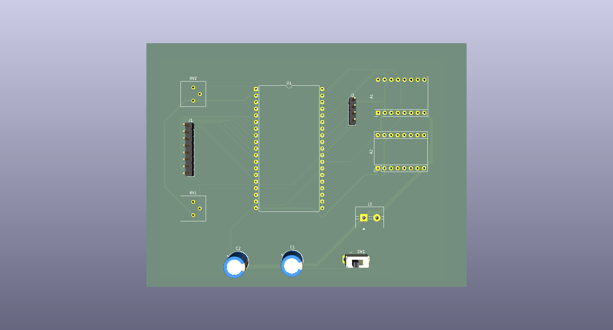

# Dieless - Automated Wire Drawing Control System 🧵⚙️⚡

An advanced embedded control system designed for a **Dieless Wire Drawing Machine** engineering project. This system coordinates independent dual-stepper motor velocity profiles, features real-time analog micro-adjustments, and utilizes a complete local Human-Machine Interface (HMI).

Developed under the auspices of the **"CREATIVE" Student Science Club**.

---

## 📺 Project Presentation & Demo

Watch the system in action on YouTube:

[](https://www.youtube.com/shorts/0vz2pSPowQI)

*Click the badge above to watch the project implementation and physical mechanical execution details.*

---

## 🚀 System Features

* **High-Performance Jitter-Free Engine:** Implements a non-blocking microsecond phase-accumulation scheduler capable of driving dual A4988 stepper drivers independently without timing drift.
* **Velocity Profiling (Ramp Rate):** Integrated linear acceleration and deceleration profiling (2000 Hz/s rate) protecting motors from stalling or losing synchronization during sudden load changes.
* **Real-Time Trim Adjustment:** Dual-potentiometer sampling with 12-bit ADC mapping, providing a precision $\pm5\%$ velocity override overlay on-the-fly.
* **4x4 Matrix Keypad Configuration:** Full operational control board layout using an asynchronous multi-state input buffer for entering specific base frequencies (Hz).
* **Optimized I2C HMI Display:** Formatted 20x4 LCD frame architecture running on a high-speed 400kHz I2C bus clock to eliminate screen update blocking latencies.

---

## 🛠️ Hardware & PCB Design

The control system has been migrated from breadboard prototyping to a dedicated, custom-designed PCB tailored for high-frequency signal switching and heavy motor current distribution. 

### 📐 PCB View (3D Render)
The board architecture implements strict physical isolation between the high-current motor power rails (VMOT) and the sensitive analog/I2C traces to completely eliminate electromagnetic interference and noise injection.



---

## 🔌 Complete Hardware Pin Mapping (Pinout)

To ensure proper hardware replication, connect the peripheral components to the ESP32 microcontroller precisely as outlined in the engineering reference tables below:

### 1. Actuators & Control Interfaces
| ESP32 GPIO Pin | Component Peripheral | Hardware Functionality / Description | Suggested Track Width |
| :---: | :--- | :--- | :---: |
| **+5V / VIN** | Main Logic Rail | Core power for driver logic and LCD module | **0.50 mm** |
| **+3.3V** | Analog Rail | Clean reference voltage for ADC potentiometers | **0.50 mm** |
| **VMOT (24V)** | A4988 Power Supply | High-current power for stepper motor coils | 🔥 **1.20 mm** |
| **GND** | System Common | Solid Ground Plane (Bottom Copper Zone) | *Copper Zone* |
| **GPIO 18** | Stepper Driver 1 (A4988) | **STEP** – Motor 1 Pulse Generation Line (Wire Feeding) | 0.25 mm |
| **GPIO 19** | Stepper Driver 1 (A4988) | **DIR** – Motor 1 Directional Logic Level Control | 0.25 mm |
| **GPIO 23** | Stepper Driver 2 (A4988) | **STEP** – Motor 2 Pulse Generation Line (Wire Drawing) | 0.25 mm |
| **GPIO 16** | Stepper Driver 2 (A4988) | **DIR** – Motor 2 Directional Control (*Safe Non-Bootstrap Pin*) | 0.25 mm |
| **GPIO 34** | Potentiometer 1 | **Analog Input** – Motor 1 Real-time Speed Trim Override | 0.25 mm |
| **GPIO 35** | Potentiometer 2 | **Analog Input** – Motor 2 Real-time Speed Trim Override | 0.25 mm |
| **GPIO 4** | SPDT Toggle Switch | **Digital Input (Internal Pullup)** – Active Motor Selection Editor | 0.25 mm |

### 2. 4x4 Membrane Keypad Matrix Connections
| ESP32 GPIO Pin | Keypad Ribbon Pin | Matrix Row / Column Designation | Suggested Track Width |
| :---: | :---: | :--- | :---: |
| **GPIO 13** | Pin 1 | **ROW 1** (Handles keys: 1, 2, 3, A) | 0.25 mm |
| **GPIO 14** | Pin 2 | **ROW 2** (Handles keys: 4, 5, 6, B) | 0.25 mm |
| **GPIO 27** | Pin 3 | **ROW 3** (Handles keys: 7, 8, 9, C) | 0.25 mm |
| **GPIO 26** | Pin 4 | **ROW 4** (Handles keys: \*, 0, #, D) | 0.25 mm |
| **GPIO 25** | Pin 5 | **COL 1** (Handles keys: 1, 4, 7, \*) | 0.25 mm |
| **GPIO 33** | Pin 6 | **COL 2** (Handles keys: 2, 5, 8, 0) | 0.25 mm |
| **GPIO 32** | Pin 7 | **COL 3** (Handles keys: 3, 6, 9, #) | 0.25 mm |
| **GPIO 17** | Pin 8 | **COL 4** (Handles keys: A, B, C, D) | 0.25 mm |

### 3. Display Peripherals & Bus Communication
| ESP32 GPIO Pin | Module / Controller | Bus Line Designation | Suggested Track Width |
| :---: | :--- | :--- | :---: |
| **GPIO 21** | I2C LCD 20x4 (PCF8574) | **SDA** – Serial Data Communication Bus | 0.25 mm |
| **GPIO 22** | I2C LCD 20x4 (PCF8574) | **SCL** – Serial Clock Bus (Configured to 400kHz Fast Mode) | 0.25 mm |

---

## ⌨️ Control Panel HMI Reference

### Keypad 4x4 Layout Matrix

| Key | Core Function | Operational Description |
| :---: | :--- | :--- |
| **`0` – `9`** | **Numeric Entry** | Inputs target step frequency values (Safe bounded range: `0` – `9999` Hz). |
| **`D`** | **Direction Stage** | Toggles the pending rotational direction profile buffer layout between `[CW]` and `[CCW]`. |
| **`#`** | **ENTER / Commit** | Flushes the staged parameters, saving target velocity and setting hardware direction pins. |
| **`*`** | **Backspace** | Removes the terminal character from the active screen buffer string. |
| **`C`** | **Clear Buffer** | Instantly wipes the temporary keyboard data input buffer. |
| **`A`** | **START Machine** | Global execution trigger. Smoothly ramps up both stepper lines to target run frequencies. |
| **`B`** | **STOP Machine** | E-Stop equivalent software override. Instantly cuts execution pulses and triggers safe deceleration. |

### LCD 20x4 Screen Topology Reference
The user interface handles full frame updates seamlessly asynchronously. The display grid mapping topology layout runs as follows:

```text
+------------------------------------+
|M1: [BaseHz] |T:[Trim%] |[ActiveDir]| -> Line 1: Wire Feeding Motor Telemetry
|M2: [BaseHz] |T:[Trim%] |[ActiveDir]| -> Line 2: Wire Drawing Motor Telemetry
|Input: [EditorBuffer]   [PendingDir]| -> Line 3: Live Input HMI Keypad Buffer
|[MachineStatus] | Ed: [TargetMotor] | -> Line 4: System Operational Status
+------------------------------------+
📂 Repository Structure
Plaintext
├── firmware/              # ESP32 Core Control Source Code (C++/Arduino)
│   ├── src/
│   │   └── main.cpp
│   └── platformio.ini
├── hardware/              # KiCad EDA Project Files & Manufacturing Exports
│   ├── dieless-control.kicad_pro
│   ├── dieless-control.kicad_sch
│   ├── dieless-control.kicad_pcb
│   └── Dieless.png        # 3D Render preview of the custom PCB layout
└── README.md              # Main project documentation
👤 Author
Developer: @Freshovsky23

Contact: Heilman.Wiktor23@gmail.com
